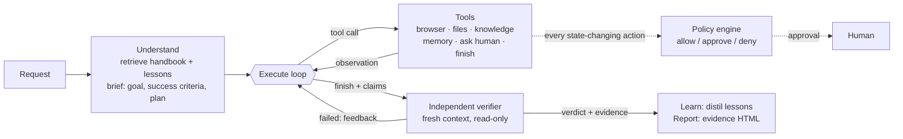

# Taskwright: an autonomous AI task worker

Submission for the CentrAlign AI **AI Engineering Intern** problem statement.

Give Taskwright a one-line request such as

> *Find the latest invoice from Acme, extract the amount and due date, enter it into our AP system, and tell me once it is done.*

and it does the work in a real browser against a simulated company. It works out what "latest" means
under company procedure, opens the PDF rather than trusting the email, signs in to the AP system,
survives an outage and a session expiry halfway through, pauses for the approval the company's policy
requires, and records the invoice. Then **a separate verifier with read-only access checks the live
system** and hands back evidence. Finally it saves what it learned for next time.

**Demo video:** _add link_

**Real runs, with their evidence reports:** [`docs/sample-runs/`](docs/sample-runs/). Open `report.html` in
each folder.

| Run | Model (free tier) | Result |
|---|---|---|
| Task 1, record Acme's latest invoice | `gemini-3.5-flash`, failing over to `3-flash-preview` and `3.5-flash-lite` | Completed and verified in 43 calls. It recorded the revised invoice and rode out the 503 and the session expiry. It fixed its own date-format mistake. |
| Task 2, reply to Umbrella's payment query | `gemini-3.5-flash-lite` | Completed and verified in 29 calls (100 s). The reply was approved, and it passed every ground-truth check. |

---

## Quick start

Python 3.11+ and an API key for one LLM provider (Anthropic, OpenAI, Gemini's free tier, OpenRouter, Groq; or a
local model through Ollama).

```bash
git clone <this repo> && cd taskwright
python -m venv .venv && source .venv/bin/activate      # Windows: .venv\Scripts\activate
pip install -r requirements.txt
python -m playwright install chromium
cp .env.example .env              # Windows: copy .env.example .env   - then put your API key in it

python -m taskwright reset                               # fresh sandbox company
python -m taskwright demo 1 --headed                     # watch it work
```

The command starts the simulated company in the background (http://127.0.0.1:8765), runs the
worker, asks you in the terminal when an approval or answer is needed, and writes an evidence report to
`runs/<run-id>/report.html`.

**Or use mission control in the browser:**

```bash
python -m taskwright ui        # open http://127.0.0.1:8800
```

From there you can pick or type a task and watch the brief, the plan, the working memory, a live view of
the worker's browser and the timeline. Approvals pop up with the exact payload, and you can approve or
decline them with a note. When the run finishes, the page shows the verified outcome and links to the
evidence report.

| Command | What it does |
|---|---|
| `python -m taskwright ui` | Mission control web UI (same runtime, approvals in the browser) |
| `python -m taskwright run "<any task>" [--headed]` | Run any request from the terminal |
| `python -m taskwright tasks` / `demo <n>` | List / run the demo tasks below |
| `python -m taskwright eval` | Run every demo task unattended and score it against ground truth |
| `python -m taskwright sandbox` | Run the simulated company on its own, then browse it yourself |
| `python -m taskwright reset [--memory] [--no-chaos]` | Reset sandbox data, optionally learned lessons, optionally turn injected failures off |
| `python -m taskwright memory` | Show what the worker has learned |
| `python -m taskwright report <run dir>` | Rebuild a run's report from its trace |
| `pytest` | Unit tests plus an end-to-end test through the real browser and sandbox (scripted model, no API key needed) |

Useful flags: `--autonomy supervised|standard|autonomous`, `--unattended` (nobody is watching, so approvals are
declined and questions go unanswered), `--slow-mo 300` (for recording), `--provider`, `--model`.

### Free tiers and rate limits

One task takes about **30 to 45 model calls** (planning, the worker, the verifier and reflection).
- **Gemini's free tier allows about 20 requests per day per model.** The Gemini preset therefore fails over
  automatically along a chain of models (`gemini-3.8-flash → 3.7 → 3.6 → 3.5 → 3-flash-preview → flash-lite`)
  when one model's daily quota is exhausted. You can set your own chain with `LLM_FALLBACK_MODELS`. Per-minute
  limits are retried with the wait the API asks for.
- **Groq's free tier allows 7,000 to 8,000 input tokens per minute per model.** That is smaller than this
  agent's working context, so use Groq's paid Dev tier. The client still rotates across models on
  per-minute limits and compacts context when a request is too large.
- Anything paid (Anthropic, OpenAI, or Gemini with billing enabled) runs a task in about 2 to 4 minutes. A run
  costs cents.

### Troubleshooting

- **`429` / `overloaded`**: rate limits are retried automatically with backoff, and the console shows each
  retry and failover. The static prompt is cached on Anthropic to reduce tokens.
- **Choosing a model**: Claude Sonnet is the most reliable choice. `LLM_MODEL` overrides any provider's
  default. Very small models struggle with long multi-step tasks.
- **Port 8765 in use**: set `TW_BASE_URL=http://127.0.0.1:<port>` in `.env`, or stop the other process.
- **Start over**: `python -m taskwright reset --memory`.
- **What exactly happened?** Every run has `runs/<id>/trace.jsonl` (all events) and `report.html`.

## Demo tasks

Four different tasks run through the **same code**. Nothing in the agent is specific to invoices.

| # | Request | What it exercises |
|---|---|---|
| 1 | Find the latest invoice from Acme, extract the amount and due date, enter it into our AP system, and tell me once it is done. | Acme sent a *revised* invoice that supersedes the original (handbook AP-4). PDF extraction. Ledgerly's date and amount formats. An injected 503 and a session expiry mid-submit. An approval over INR 50,000. Independent verification. |
| 2 | Umbrella emailed asking about the payment status of their invoice. Look it up and reply to them. | A different workflow: find the email, look up the record, write a policy-compliant reply. External email needs approval. |
| 3 | Process the vendor invoices that came into the AP mailbox in the last 10 days and are not yet in Ledgerly. | Judgement across several items. It records the valid invoices, skips the superseded original, refuses a look-alike phishing domain (AP-2), asks about a vendor that is not onboarded (AP-7), and avoids duplicates. |
| 4 | Give me a CSV of every unpaid invoice due in October with vendor, invoice number, amount and due date, sorted by due date. | A read-only analysis task with a file deliverable. The verifier re-derives the list itself. |

Run 1 and then 3 without resetting memory to see learning. A quirk discovered in run 1, such as Ledgerly's
`DD/MM/YYYY` date format, is retrieved into run 3's context before the worker touches the form.

## How it works



**1. Understand and plan** (`runtime._understand`). The request, the relevant handbook sections (BM25 retrieval)
and lessons from earlier runs go to the model, which returns a structured brief: the goal, an interpretation of
the ambiguous parts, **success criteria that can be checked in the systems**, applicable procedures, risks and
a high-level plan. Only questions that block all progress are asked up front.

**2. Execute, observe, adapt** (`loop.AgentLoop`). This is a native tool-calling loop. Each turn the system prompt
is rebuilt with the live working state: brief, plan with statuses, facts recorded so far with their sources,
clarifications, lessons and remaining budget. The model therefore never depends on a long transcript to
remember what it found. Every browser action returns the new page, so observation is built into acting.
Failures come back as typed observations (`transient`, `stale`, `invalid`, `blocked`, `denied`), and the
runtime reacts to them:
- *Transient* failures of **idempotent** actions are retried automatically with backoff. A failed POST is
  **never** replayed: the agent is told the outcome is unknown and has to check first.
- When one tool call in a batch fails, the remaining calls are skipped, because they were planned against a
  page that no longer exists.
- A loop detector notices repeated identical calls or a run of failures and injects a corrective nudge.
- Old page snapshots are elided from context while the latest ones stay verbatim.

**3. Act through the browser** (`tools/browser.py`). Pages are rendered as compact text in which every
interactive element has a ref, such as `[e11 button "Save invoice"]`. Page alerts and HTTP errors are
pulled to the top so they are never lost. Downloads land in the run's workspace, and PDFs are read with
their layout preserved.

**4. Guardrails in code, not in the prompt** (`policy.py`, `config/policies.toml`). Before any click or
Enter that would change state, the runtime reads **exactly what will be submitted** (every form field) and
evaluates the company's rules:
- the AP-3 threshold (amount of INR 50,000 or more needs approval),
- external email needs review,
- deletes and payments are denied.

An approval is bound to the payload, so a resubmission of the same data after a session expiry does not ask
twice, while any change asks again. Autonomy levels are `supervised`, `standard` and `autonomous`.

**5. Secrets by reference** (`vault.py`). The model types `{{secret:LEDGERLY_PASSWORD}}`. The runtime
substitutes the value at the moment of typing, **only on allowed hosts**, so an injected page cannot harvest
it. It also redacts the value from every observation, log and report.

**6. Independent verification** (`runtime._verify`). When the worker calls `finish` with specific claims, a
separate loop starts in a **fresh browser context** with a **read-only** policy and no access to the worker's
reasoning. It receives the success criteria and the claims, treats the claims as unverified, checks the system
of record (re-reading source documents where values matter), screenshots the evidence, and returns a verdict
per criterion. A failed verdict goes back to the worker as feedback for a bounded rework round. The runtime
also refuses an overall "verified" if any single criterion did not pass.

**7. Learn** (`runtime._reflect`, `memory.LessonStore`). After the run, the trace is condensed and the model
distils 0 to 4 reusable lessons, for example system quirks, what a person clarified, or procedures. They are
deduplicated and stored in `memory/lessons.jsonl`, then retrieved into future runs. This is the start of
company-specific personalization.

**8. Evidence** (`report.py`). Each run writes `runs/<id>/report.html`. It contains the outcome, the
per-criterion verification with evidence, how the request was interpreted, the facts with sources, every
approval and question, evidence screenshots, and a full timeline with a screenshot after every action. The
machine-readable `trace.jsonl` next to it is the single source the console, report and reflection are all
built from.

### The simulated company (`sandbox/`)

A real FastAPI web app for "Northstar Retail" with three parts:
- **Mail**: a shared AP inbox with PDF invoice attachments.
- **Ledgerly**: the AP system, with login, validation, duplicate detection and a vendor master.
- **Handbook**: procedures and the vendor directory.

The worker can only use it through the browser, the same way a person would. The data contains realistic
traps:
- a revised invoice that supersedes the original,
- a look-alike phishing domain asking for payment to new bank details,
- a vendor that is not onboarded,
- already-recorded invoices.

Chaos is on by default. The first visit to the invoice list returns **503**, and the first invoice submit
**expires the session** and discards the form. Turn this off with `reset --no-chaos`.

## Key design decisions

| Decision | Why |
|---|---|
| DOM-grounded browser control (element refs) instead of screenshots and pixel clicks | It is cheaper, deterministic and debuggable. Above all, the runtime can inspect *what an action will submit* before it happens, which is what makes payload-bound approvals and policy possible. A pixel-level backend can sit behind the same tool interface for apps without a DOM. |
| Policy enforced by the runtime at the moment of action | Prompts are suggestions. A confused or prompt-injected model must not be able to talk its way past "invoices over INR 50k need approval". |
| A separate, read-only verifier | A worker grading its own work is biased toward "done". The verifier starts cold, cannot change anything, must find evidence, and its verdict is checked again in code. |
| Success criteria defined *before* execution | Criteria written before acting make "done" falsifiable and give the verifier something concrete to check. |
| Working state re-injected every turn, old observations compacted | Long tasks stay coherent without an ever-growing context. Facts carry their sources. |
| Idempotency-aware recovery | Automatic retry is safe only for reads. For writes, the agent has to check whether the write happened, because duplicate invoices are worse than slow ones. |
| Secrets as references, scoped by host | The model never needs to know a password, and a malicious page cannot obtain one. |
| One provider-neutral loop with native tool calling, stdlib HTTP | It works with Claude, OpenAI, Gemini, OpenRouter, Groq or local Ollama by changing an env var. There are no agent frameworks to fight. |
| Company knowledge and policy as data (`company/`, `config/`) | Personalizing the worker for another company means editing markdown and TOML, not code. |

## Evaluation criteria, mapped

| Criterion | Where to look |
|---|---|
| Autonomy | The brief fills in unstated steps from the handbook (which invoice is "latest", the threshold, sender checks). Only blocking questions are asked. |
| Execution | A real browser on a real web app, real PDF downloads and parsing, real form submissions and real emails sent. Nothing is mocked inside the agent. |
| Reliability | Typed errors, idempotency-aware retries, batch abort, stall detection, budget, session-expiry and 503 recovery, rework after a failed verification. |
| Verification | Criteria are defined up front. An independent read-only verifier, evidence screenshots, and a code-level guard against lenient verdicts. `eval` also scores the verifier against ground truth. |
| Generalization | Four different tasks with zero task-specific code. Swapping `company/` and `config/` retargets it. |
| Engineering quality | Small modules with one responsibility, a full trace, unit tests and an end-to-end browser test. |
| Product thinking | Approvals show the exact payload. The final message is written for the requester. The report is something a manager can audit. |

## Project layout

```
taskwright/            the worker
  runtime.py           one run: understand -> execute -> verify -> learn -> report
  loop.py              tool-calling loop: dispatch, retries, batch abort, stall detection, compaction
  llm.py               Anthropic + OpenAI-compatible adapters, retries, structured output
  prompts.py           every prompt in one place
  policy.py vault.py   guardrails and credential handling
  memory.py            working memory, handbook retrieval, long-term lessons
  tools/               browser (+ snapshot.js), files, knowledge/plan/memory/human/finish
  report.py console.py evidence report and live terminal view
  web.py web_ui.html   mission control: SSE event stream, approvals/questions answered in the browser
  demo_tasks.py        demo tasks + ground-truth checks for `eval`
sandbox/               the simulated company (FastAPI): mail, Ledgerly, handbook, invoice PDFs
company/               the company's knowledge: handbook markdown, systems list
config/                policies.toml (guardrails), vault.toml (sandbox test credentials)
tests/                 unit tests, end-to-end test with a scripted model
runs/ memory/          created at runtime: per-run reports/traces, learned lessons
```

## Models, APIs and components used

- **LLM**: any of
  - Claude (Anthropic Messages API, default `claude-sonnet-5-5`),
  - OpenAI (`gpt-4.1`),
  - Gemini (`gemini-3.8-flash` with a failover chain, through its OpenAI-compatible endpoint, with thought
    signatures echoed back as Gemini 3 requires),
  - OpenRouter, Groq or Ollama.

  All of them are called with plain HTTP and native tool calling. No agent framework is used. The sample runs
  used Gemini's free tier.
- **Playwright** (Chromium) for the browser. **FastAPI + Uvicorn** for the sandbox. **pypdf** for PDF text,
  **ReportLab** to generate the sandbox's invoice PDFs, **Markdown** to render the handbook, **pytest**.
- The DOM snapshot script, policy engine, vault, BM25 retrieval, loop and verifier are written for this
  project.
- AI coding assistants were used while building it, as the brief allows.

## Assumptions

- Systems are reached through their web UIs, as a new employee would reach them. No APIs or back doors are
  assumed.
- The sandbox world is frozen on **4 October 2026**, so that "the last 10 days" stays meaningful. The worker
  is told this date. Override it with `TW_TODAY`.
- Invoices are text-based PDFs. "Latest invoice" means the most recent *valid* one under company procedure,
  so a revision supersedes the original and a look-alike sender is not valid.
- Credentials in `config/vault.toml` are sandbox test values. Real deployments would inject them as
  `TW_SECRET_<NAME>` environment variables or from a secrets manager.

## Known limitations

- Browser apps only. Native desktop apps and canvas-only UIs would need an OS-level computer-use backend
  behind the same tool interface.
- Very large pages are truncated in the snapshot. There is no "focus on region" or scroll tool yet.
- The verifier is the same model family as the worker, so errors can be correlated. It mitigates this with a
  fresh context, read-only access and evidence requirements, but a different model or deterministic checks
  would be stronger.
- Lessons are retrieved lexically and are not reviewed by a person, so a wrong lesson could persist.
  `memory --clear` removes them.
- One task runs at a time. There is no queue, scheduler or resumable checkpoint yet, and an approval waits
  as long as it takes.
- Policy rules match form field names. JavaScript-heavy apps that do not use forms would need richer action
  classification.
- PDFs need a text layer (no OCR).
- On free tiers, most of a run's wall time is spent waiting out rate limits. Task 1's sample run took 8
  minutes, most of it waiting.

## What I would build next

1. **Approvals where people already are**: Slack or email, in addition to mission control, with timeouts
   and escalation.
2. **Durable execution**: a task queue, background workers, schedules, and checkpointed `RunState` + messages
   so a run can resume after a crash or a long wait for approval.
3. **Learned procedures**: compile successful traces into parameterised workflows that replay
   deterministically and fall back to the LLM only when the page diverges. This is faster, cheaper and more
   predictable.
4. **API-first connectors with browser fallback**: the same tool contract over Ledgerly's API when one exists.
5. **A stronger verifier**: deterministic checks where a schema exists, plus a different model for judgement
   calls.
6. **A pixel-level computer-use backend** for desktop apps, behind the existing browser tool interface.
7. **A larger eval suite in CI**: more tasks, perturbed environments, and verifier-vs-truth agreement tracked
   over time.
# taskwright
